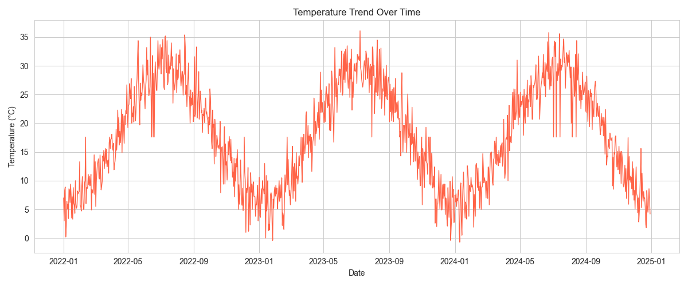
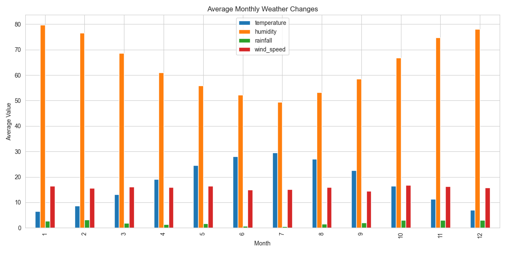
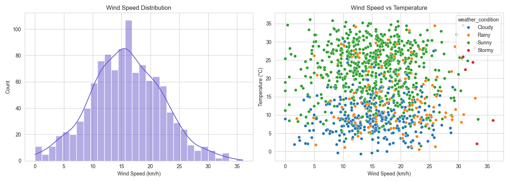

# Weather Forecast System

A complete, beginner-friendly machine learning project that analyzes historical
weather data and forecasts **temperature**, **rainfall**, **humidity**, and
**weather condition** (Sunny / Cloudy / Rainy / Stormy) using only Python
libraries: Pandas, NumPy, Scikit-learn, Matplotlib, Seaborn and Joblib.

No external APIs or internet access are required — a realistic synthetic
3-year daily weather dataset is generated locally and used for the entire
pipeline.

## Screenshots

**Temperature trend over 3 years:**



**Monthly average weather changes:**



**Wind speed analysis:**



More charts (rainfall trend, humidity trend, monthly condition counts) are
in the [`outputs/`](outputs/) folder.

## Project Structure

```
weather-forecast-system/
├── data/
│   ├── raw_weather_data.csv        # sample dataset (generated, with missing/duplicate rows)
│   ├── cleaned_weather_data.csv    # after data cleaning
│   └── featured_weather_data.csv   # after feature engineering
├── models/
│   ├── best_temperature_model.pkl
│   ├── best_rainfall_model.pkl
│   ├── best_humidity_model.pkl
│   ├── best_weather_condition_model.pkl
│   ├── weather_condition_label_encoder.pkl
│   └── *_features.pkl              # feature lists saved alongside each model
├── outputs/
│   ├── temperature_trend.png
│   ├── rainfall_trend.png
│   ├── humidity_trend.png
│   ├── wind_speed_analysis.png
│   ├── monthly_weather_changes.png
│   └── monthly_condition_counts.png
├── src/
│   ├── config.py               # paths & constants
│   ├── generate_dataset.py     # creates the sample weather dataset
│   ├── data_cleaning.py        # missing values, duplicates, invalid ranges
│   ├── feature_engineering.py  # date, month, season features
│   ├── eda.py                  # exploratory analysis & charts
│   ├── model_utils.py          # shared feature lists, metrics, joblib I/O
│   ├── train_models.py         # Linear Regression / Decision Tree / Random Forest
│   ├── train_classifier.py     # weather condition classification
│   └── predict.py              # forecast for new weather inputs
├── main.py                     # runs the full pipeline end-to-end
├── requirements.txt
└── README.md
```

## Setup

1. **Create a virtual environment** (recommended):

   ```bash
   python -m venv venv
   venv\Scripts\activate        # Windows
   source venv/bin/activate     # macOS/Linux
   ```

2. **Install dependencies**:

   ```bash
   pip install -r requirements.txt
   ```

## Running the Project

Run the entire pipeline (dataset generation → cleaning → feature engineering
→ EDA charts → model training → best model selection → saving models) with
one command from the project root:

```bash
python main.py
```

This will:

1. Generate `data/raw_weather_data.csv` — a synthetic 3-year daily weather
   dataset with realistic seasonal patterns, plus intentionally injected
   missing values and duplicate rows.
2. Clean the data (fill missing values, drop duplicates, clip invalid
   ranges) → `data/cleaned_weather_data.csv`.
3. Engineer features (year, month, day, day-of-year, season) →
   `data/featured_weather_data.csv`.
4. Run exploratory data analysis and save charts to `outputs/`.
5. Train **Linear Regression**, **Decision Tree Regressor**, and
   **Random Forest Regressor** for temperature, rainfall and humidity,
   evaluate each with **MAE, MSE, RMSE, R²**, and save the best model per
   target to `models/` using Joblib.
6. Train Logistic Regression / Decision Tree / Random Forest classifiers for
   weather condition (Sunny, Cloudy, Rainy, Stormy), evaluate with accuracy
   and a classification report, and save the best one.

### Making Predictions

Once `main.py` has been run at least once (so trained models exist in
`models/`), forecast weather for new inputs:

```bash
python src/predict.py
```

Or supply your own values:

```bash
python src/predict.py --date 2026-08-01 --temperature 31 --humidity 55 --wind_speed 10 --rainfall 0
```

This prints predicted temperature, rainfall, humidity, and weather condition
for the given date and estimated current conditions.

### Running Individual Steps

Every step can also be run on its own from the project root:

```bash
python src/generate_dataset.py
python src/data_cleaning.py
python src/feature_engineering.py
python src/eda.py
python src/train_models.py
python src/train_classifier.py
```

## How Forecasting Works

Each target (temperature, rainfall, humidity, weather condition) is modeled
using the same pool of engineered features — `month`, `day_of_year`,
`season_code`, `temperature`, `humidity`, `wind_speed`, `rainfall` — with the
target column itself excluded from its own feature set. For example, the
temperature model is trained on `month, day_of_year, season_code, humidity,
wind_speed, rainfall`. This lets `predict.py` answer "what-if" questions:
given a date and a set of observed/estimated conditions, what does each
model expect for the target it doesn't already know?

## Model Evaluation

For each regression target, three models are trained and compared:

| Model | Metric used for comparison |
|---|---|
| Linear Regression | MAE, MSE, RMSE, R² |
| Decision Tree Regressor | MAE, MSE, RMSE, R² |
| Random Forest Regressor | MAE, MSE, RMSE, R² |

The model with the **highest R² score** on the held-out test set is selected
and saved as the "best" model for that target.

For weather condition classification, three classifiers (Logistic
Regression, Decision Tree, Random Forest) are compared using:

| Metric | What it measures |
|---|---|
| **Accuracy** | Overall % of days classified correctly |
| **Precision** | Of the days predicted as a given condition, how many actually were |
| **Recall** | Of the days that were actually a given condition, how many were caught |
| **F1-score** | Balance between precision and recall (weighted across all classes) |

The classifier with the **highest accuracy** is selected as the best model,
and a full per-class classification report (precision/recall/F1 for each of
Sunny/Cloudy/Rainy/Stormy) is printed for a detailed breakdown.

Note: rainfall is inherently noisy/hard to predict from date and other
weather variables alone (it is naturally close to random in the synthetic
data, just like in the real world), so its R² will be much lower than
temperature's — this is expected and reflects the real difficulty of rainfall
forecasting, not a bug.

## Visualizations

`eda.py` (run automatically by `main.py`) produces the following charts in
`outputs/`:

- **temperature_trend.png** — daily temperature over the full history
- **rainfall_trend.png** — daily rainfall over the full history
- **humidity_trend.png** — daily humidity over the full history
- **wind_speed_analysis.png** — wind speed distribution + wind speed vs.
  temperature scatter, colored by weather condition
- **monthly_weather_changes.png** — average temperature/humidity/rainfall/wind
  speed per month
- **monthly_condition_counts.png** — weather condition counts per month

## Notes

- The dataset is synthetic but designed to mimic realistic seasonal weather
  behavior (colder & more humid in winter, warmer & drier in summer, rainier
  and windier conditions correlating with "Rainy"/"Stormy" labels).
- All processing is done with pure Python data-science libraries — no
  external weather API is called.
- Random seeds are fixed (`RANDOM_STATE = 42` in `src/config.py`) so results
  are reproducible.
